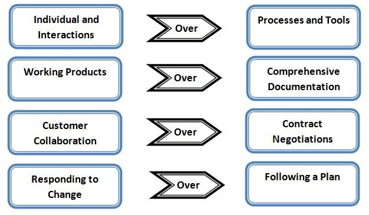

# 2	AGILE TRANSFORMATION
## 2.1	Waterfall background (where is the reader coming from)
It is challenging to use agile methods in the DoD and AF because the workforce has been trained in and has practiced using the required waterfall methodology for 50+ years.  In many ways, it was instituted as a way to carefully control risk along the development path and accommodate the often stove piped organizations that supported development efforts.  This means that the processes, procedures, acquisition rules, contracting approaches, testing requirements, and so on are all based on the waterfall method. 
## 2.2	Agile Introduction
### 2.2.1	4 Agile Values
The Agile Manifesto describes the overarching beliefs of Agile software development as follows (http://agilemanifesto.org): 
  
We are uncovering better ways of developing software by doing it and helping others do it. Through this work we have come to value:   
#

#
That is, while there is value in the items on the right, we value the items on the left more.   

### 2.2.2	Benefits
1.	Higher quality product (incremental development, continuous integration and automated testing tools allow developers to fix issues quicker when they are fresh in their mind and have fewer secondary effects on code built on top of a bug).  
2.	Ability to change dynamically to customer/user wants, needs, and/or requirements (value adaptation based on increased transparency, formal feedback events, and high degree of customer collaboration).  
3.	Ability to balance workloads based on cross-functional teams (while team members often have areas of expertise, agile emphasizes cross-functionality which allows flexibility to surge resources as necessary).  Decreases and eventually eliminates the “throw over the wall” approach, thereby allowing development, operations, and security to work together iteratively to swarm on a particular issue or bug, should one come up, during releases to lower environments (this decreases the risk of failures in production if all environments are aligned and mirrored-appropriately). 
4.	Shorter implementation time to usable product (provides quicker return on investment, decreased risk of project failure, faster end-user feedback into the development cycle and increased customer satisfaction).  
5.	Ability to balance technical debt and new functionality, thereby decreasing technical debt over time. 
